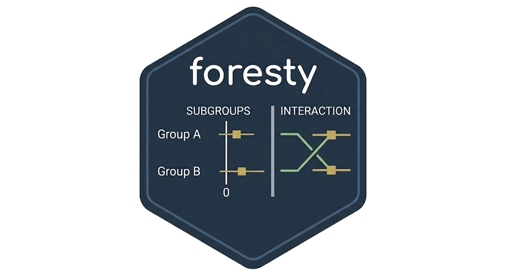
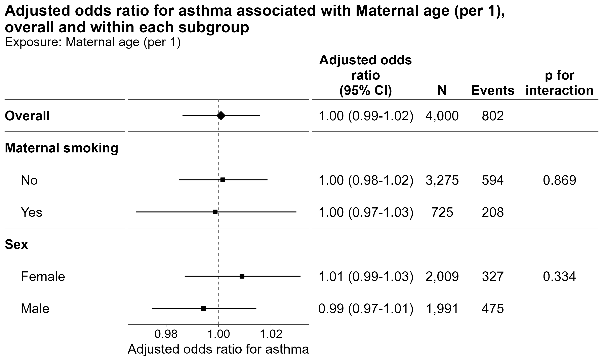
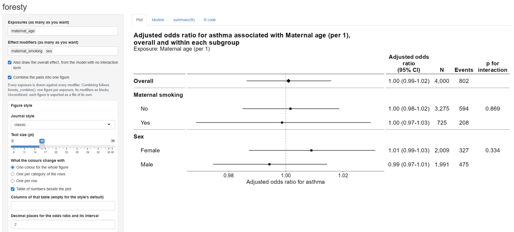
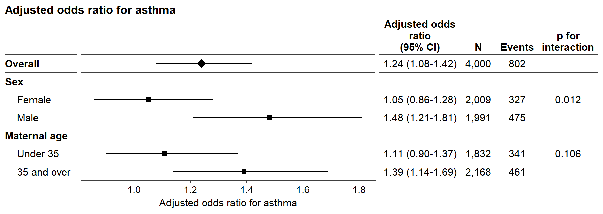

# foresty



Visualize interaction effects with publication-ready forest plots.

An interaction p-value tells you whether the effect differs between
subgroups, but not **which subgroup shows the effect, in which
direction, or by how much**. `foresty` puts the interaction test and the
subgroup estimates side by side, making interaction effects easier to
interpret and report.

It also makes **publication-ready** forest plots easy to produce, with a
Shiny app for exploring the results interactively and an **HTML report**
that documents the model behind them.



## Try it first



Installation:

``` r

# install.packages("devtools")
remotes::install_github("AkiShiroshita/foresty")
```

Start with a model **without an interaction term** and let `foresty`
explore possible exposure–modifier interactions:

``` r

library(foresty)

fit <- glm(
  asthma ~ no2 + sex + maternal_smoking + maternal_age,
  family = binomial,
  data = foresty_cohort
)

foresty_app(fit)
```

The app lets you select exposures and effect modifiers, choose how big a
difference in the exposure each estimate is for — an interquartile
range, two quantiles of it, an increment of your own — adjust the figure
style, and produce forest plots and reports without having to remember
the plotting code.

It opens in your browser, and its **R code** tab writes the code twice
over: the `foresty` call that drew the figures, and — under *How to
calculate effect estimates for each subgroup* — where those numbers come
from, in base R and the `car` package with nothing from this package in
them. So interactive exploration becomes a reproducible script either
way.

## Publication-ready styles

`foresty` provides several predefined styles:

| Style       | Description                         |
|-------------|-------------------------------------|
| `"classic"` | Simple forest plot with a null line |
| `"jama"`    | JAMA-inspired layout                |
| `"nejm"`    | NEJM-inspired layout                |
| `"lancet"`  | Lancet-inspired layout              |
| `"bmj"`     | BMJ-inspired layout                 |
| `"revman"`  | Cochrane RevMan-inspired layout     |

Styles are approximations of journal layouts rather than official
journal templates.

The output can be customized further with ordinary `ggplot2` layers, and
it can be passed to [`summary()`](https://rdrr.io/r/base/summary.html),
[`predict()`](https://rdrr.io/r/stats/predict.html),
[`broom::tidy()`](https://generics.r-lib.org/reference/tidy.html), and
[`broom::glance()`](https://generics.r-lib.org/reference/glance.html),
etc.

## Supported models

`foresty` works with fitted models that provide coefficients, a
covariance matrix, and a model frame. Tested model classes include:

| Package | Models |
|----|----|
| base R | [`glm()`](https://rdrr.io/r/stats/glm.html), [`lm()`](https://rdrr.io/r/stats/lm.html) |
| `survival` | `coxph()`, `survreg()` |
| `lme4` | `lmer()`, `glmer()` |
| other | [`MASS::polr()`](https://rdrr.io/pkg/MASS/man/polr.html), [`nnet::multinom()`](https://rdrr.io/pkg/nnet/man/multinom.html), [`geepack::geeglm()`](https://rdrr.io/pkg/geepack/man/geeglm.html) |

The effect measure is inferred from the model where possible, including
odds ratios, hazard ratios, risk ratios, incidence rate ratios, and mean
differences.

Robust and cluster-robust standard errors are also supported where
applicable.

`rms` fits – `lrm()`, `ols()`, `cph()`, `psm()`, `Glm()`, `orm()` – are
**not** supported. A variable *transformed* by `rms` is a different
thing and is still read: `rms::rcs(x, 4)` inside a
[`glm()`](https://rdrr.io/r/stats/glm.html) formula is a spline basis
like any other, as are
[`splines::ns()`](https://rdrr.io/r/splines/ns.html),
[`splines::bs()`](https://rdrr.io/r/splines/bs.html) and
[`stats::poly()`](https://rdrr.io/r/stats/poly.html).

## What foresty does not do

`foresty` is intentionally focused on **two-way exposure × modifier
interactions**.

- **No three-way interactions.** One call handles one exposure and one
  modifier. Multiple modifiers can be shown as separate blocks with
  [`foresty_combine()`](https://akishiroshita.github.io/foresty/reference/foresty_combine.md),
  but they are not crossed with each other.
- **No automatic categorization of continuous modifiers.** If a
  continuous modifier should be categorized, choose the cut points
  yourself and refit the model.
- **No separate subgroup refitting.** `foresty` estimates subgroup
  effects from one model containing the interaction rather than fitting
  separate models within each subgroup.

## Use it in R

`foresty` has four main functions (see
[`vignette("forest")`](https://akishiroshita.github.io/foresty/articles/forest.md)
for details):

1.  **[`foresty_main()`](https://akishiroshita.github.io/foresty/reference/foresty_main.md)**
    — draws the effect of one or more exposures from models you have
    already fitted.
2.  **[`foresty_interaction()`](https://akishiroshita.github.io/foresty/reference/foresty_interaction.md)**
    — the core of the package: it adds the exposure × modifier
    interaction to a fitted model, estimates the exposure effect within
    each level of the modifier, and tests the interaction.
3.  **[`foresty_combine()`](https://akishiroshita.github.io/foresty/reference/foresty_combine.md)**
    — puts an overall estimate and several subgroup analyses into one
    publication-ready figure.
4.  **[`foresty_data()`](https://akishiroshita.github.io/foresty/reference/foresty_data.md)**
    — draws the same figure from estimates you already have: a data
    frame, tibble or data.table with one row per row of the figure, for
    numbers that did not come out of a model `foresty` can read.

## More flexible way

Do you want to adjust for multiplicity (e.g., using the false discovery
rate)? Do you want to perform multiple imputation and present pooled,
subgroup-specific estimates? Of course, you can! Prepare the data you
want to present and use
[`foresty_data()`](https://akishiroshita.github.io/foresty/reference/foresty_data.md).

``` r

subgroups <- data.frame(
  subgroup  = c("Overall", "Female", "Male", "Under 35", "35 and over"),
  block     = c("Overall", "Sex", "Sex", "Maternal age", "Maternal age"),
  overall   = c(TRUE, FALSE, FALSE, FALSE, FALSE),
  estimate  = c(1.24, 1.05, 1.48, 1.11, 1.39),
  conf.low  = c(1.08, 0.86, 1.21, 0.90, 1.14),
  conf.high = c(1.42, 1.28, 1.81, 1.37, 1.69),
  n         = c(4000, 2009, 1991, 1832, 2168),
  events    = c(802, 327, 475, 341, 461),
  p_int     = c(NA, 0.012, NA, 0.106, NA)
)

library(foresty)

foresty_data(
  subgroups,
  label = "subgroup", group = "block", emphasis = "overall",
  interaction_p = "p_int",
  measure = "OR", outcome = "asthma", adjusted = TRUE
)
```



## Acknowledgements

- Claude Code (Anthropic’s Claude Opus 5) assisted with adding notes,
  testing and English-language proofreading. The design, decisions and
  final responsibility remain the author’s.

- Subgroup-specific effect sizes are computed through
  [car](https://CRAN.R-project.org/package=car).

- The forest plot designs took their cues from
  [meta](https://CRAN.R-project.org/package=meta).

## License

GPL-3.
